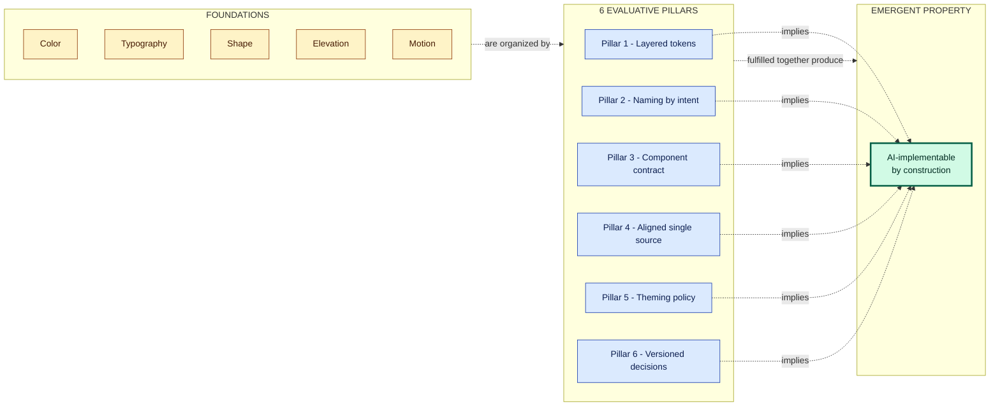

# AI-implementable as an emergent property

---

A complementary doc to `design-system-pillars.md`. There, the 6 pillars are presented as evaluation criteria for a DS for humans. Here, the angle is different: **a DS that satisfies the 6 pillars is, by construction, implementable by an agent** — without needing more explicit rules. AI-implementable is not a separate pillar. It is an emergent property.

Reading prerequisite: you need to know the vocabulary and the 6 pillars from `design-system-pillars.md` (or an equivalent). This doc does not redefine the terms.

---

## Thesis

The 6 pillars were designed for human problems: cheap rebrand, dark mode without refactor, detectable drift, auditable contract. **The surprise is that these same pillars are exactly what an AI agent needs to generate consistent code from a design.** It is not a coincidence: both "consumers" (human dev and agent) need the same invariants — names that carry intent, layers that isolate change, 1:1 contract, queryable decisions.

That is why "AI-implementable" is not a separate goal. It is a **diagnostic** of a quality that has always been important. The difference is that AI makes this diagnostic more visible, faster, cheaper.

---

## What an agent needs, in order

An AI agent generating code from Figma needs, in sequence:

1. Identify which code component corresponds to the Figma component. **(solved by: pillar 4 — Code Connect mapping)**
2. Know which value to use where — text in which color? **(solved by: pillar 1 — layers, and pillar 2 — semantic names)**
3. Not overwrite existing variants or invent new ones. **(solved by: pillar 3 — contract)**
4. Know whether a color responds to Light/Dark. **(solved by: pillar 5 — theming policy)**
5. Not recreate already-existing tokens. **(solved by: pillar 4 — drift detection flags hardcoded)**
6. Know why a token exists when it needs to decide to keep or replace it. **(solved by: pillar 6 — decisions)**

Each item below unpacks how the corresponding pillar delivers this.

---

## Pillar 1 — Layered tokens → the agent knows which layer to bind

Without layers, the agent sees `#EF4444` in Figma and has three choices: bind `red-500` in the component, create an ad-hoc class, or hardcode. All wrong.

With layers, the agent sees the bound token (`theme.primary`) in Figma, finds `theme.primary` in the CSS, and binds it in the component. A mechanical decision.

Without pillar 1, agents generate code that "works visually" but breaks the DS — multiplying exactly the work the DS was supposed to avoid.

---

## Pillar 2 — Naming by intent → the agent does not confuse appearance with purpose

The agent reads "primary" and knows this is the brand's main color, regardless of hue. It reads "destructive" and knows it is a destructive action. It does not confuse it with "blue" — because the name does not say "blue".

When the agent needs to decide "is this button primary or cta?", it looks at Figma, sees the applied token, replicates it. No inference about hue.

Pillar 2 prevents the agent from falling into traps like "there is `error-red`, I'll use it for error status" — without knowing that the team uses `destructive` for that and `error-red` is a primitive.

---

## Pillar 3 — Component contract → the agent generates correct variants

The agent sees `<Button variant="primary" size="md">` in Figma. To generate code, this contract must exist 1:1 in React. Pillar 3 guarantees it.

Without pillar 3, the agent will: try `variant="primary"` (does not exist in code), infer `className="btn-primary"` (not conventional), or generate inline styles. Inconsistent output.

With pillar 3, the mapping is direct.

Default A11y (accessibility) is particularly important: an agent rarely remembers to add `:focus-visible` correctly. If the component already has it by default, the agent does not even need to think about it.

---

## Pillar 4 — Aligned single source → the agent detects its own drift

Newly generated agent: "I'll use `#FFFFFF` here". Hardcoded scanner in CI: "❌ hardcoded in component". The agent rewrites using `surface-default`. Self-correction.

Without a detector, the agent accumulates hardcodes and nobody notices. The DS degrades slowly.

More subtle: Code Connect mapping allows the agent, when reading a Figma frame, to know which code component corresponds — without needing to infer from the name (`Card.tsx` could be anything). Deterministic output instead of guessing.

---

## Pillar 5 — Explicit theming policy → the agent knows when to apply theme

The agent sees a color in Figma. Is it bound to `theme.surface-default`? Apply theme. Is it hardcoded `#000`? It may be a theme-independent zone (correct to keep hardcoded) or it may be a bug (should be theme).

Explicit theming policy gives the agent the rule: "is this zone theme-independent? consult the doc. Yes? keep hardcoded. No? bind theme."

Without policy, the agent does the wrong thing with equal confidence in both cases.

---

## Pillar 6 — Versioned decisions → the agent recovers context without hallucinating

The agent is messing with a component. It finds a strange token (`theme.cta-secondary`). Question: why does this token exist?

With a decision log, the agent reads: "TD-23: theme.cta-secondary created on 2026-04-12 to support seasonal campaigns without touching primary." Mechanical decision: preserve.

Without a decision log, the agent: either ignores it (perpetuates the token), or hallucinates a reason ("probably it is the brand's dark mode"), or suggests removal ("looks duplicated from primary"). Wrong in varying proportions.

Pillar 6 transforms "why" from guesswork into prose lookup. The agent recovers context without inventing.

---

## Synthesis

```
Pillar 1 → layer to bind
Pillar 2 → semantic name does not confuse
Pillar 3 → 1:1 contract
Pillar 4 → drift detected and corrected
Pillar 5 → theme applied when it should
Pillar 6 → queryable decisions
```

Visually, the relationship foundations → pillars → emergent property:



---

## The ultimate test

**Given only the DS documentation (no human-in-the-loop, no in-person onboarding), can a competent agent implement a feature using the correct components, the correct tokens, with correct states, and respecting theming?**

If yes, the DS is satisfying the 6 pillars. If not, there is a weak pillar — and that is where to invest.

This test is worth it **even before thinking about AI**. A DS that satisfies this criterion is also a DS where junior devs produce consistent code, new designers use the correct tokens, and the product does not diverge under deadline pressure. AI is the **extreme case** of the same criterion: zero human context, pure DS reading.

That is why AI-implementable is not a new goal — it is a diagnostic of a quality that has always been important. The difference is that AI now makes this diagnostic more visible, faster, cheaper.

---

## Where to go next

- **`design-system-pillars.md`** — the parent doc, with the 6 pillars explained in themselves.
- **Code Connect (Figma)** — `figma.com/code-connect` — declarative Figma↔code mechanism that reduces pillar 4 friction when AI is part of the flow.
- **MCP servers for Figma** — tools like the Figma Dev Mode MCP expose `get_code_connect_map`, `get_design_context`, `get_screenshot`. Without explicit Code Connect, the pipeline still works via consistent naming + these contexts.
